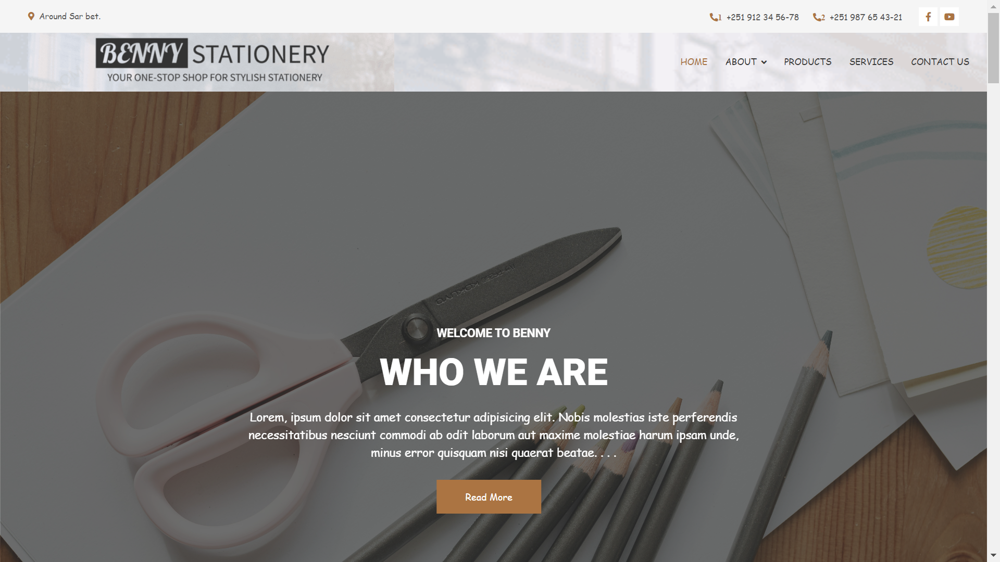

# BENNY STATIONERY

## Our Group Name Origin
The group name "`BENNY` represents the initials of our members name: Biruk, Ezra, Nathan, Napi, and Yetemgeta. We also include Sandros in the acronym by using the letter "S" in `stationery.` This symbolizes our unity, acknowledges every member, and reflects our shared goals and individual contributions. Our group identity is a testament to our strong bond and collective strength.

## Acknowledgements:

* We are grateful to God for guiding and supporting us throughout this project.

* Thank you to Dan Energy for providing us with the opportunity to participate in this valuable coding course. The knowledge and skills gained have been truly beneficial.

* Our classmates deserve acknowledgment for their kindness and support throughout our learning journey. Their encouragement has made the experience even more enjoyable.

* We extend our heartfelt appreciation to our instructors and mentors() for their guidance and dedication, which has been instrumental in our learning and growth.

These acknowledgments highlight the collaborative efforts and support that have contributed to our achievements.

  

  <h3 align="center">BENNY STATIONERY</h3>

  

Benny Stationery: Where your imagination can run wild.     
    <a href="https://github.com/yetemgeta/Benny._.stationery"><strong>Github Repository  »</strong></a>
     

## About the project

 
<!--     -->

<!-- This project was made by in collaboration the members of `BENNY` group. Initially we were thinking to use  `HTML`, `CSS`, `Javascript`, and `Python`, but unfortunately while we were using Pyhton and trying to connect it with the HTML, It was very very tough for us. So because of the above reason we only use `HTML`, `CSS`, `Javascript`. And we want you to know that our project lack a lot of work we , the member of the group, are grade 12 students and we were very busy with models and assignments so we didn't give the project pur time work on it. it's version 1 so we'll try to do a very great job on the upcoming versions. -->

This project was a collaborative effort by the members of the `BENNY` group. Initially, our plan was to utilize `HTML`, `CSS`, `Javascript`, and `Python`. However, we encountered significant difficulties when attempting to integrate `Python` with `HTML`. As a result, we proceeded with using only `HTML`, `CSS`, and `Javascript`.

>We would like to emphasize that our project is still a work in progress and lacks substantial development. As grade 12 students, we faced time constraints due to our commitments to exams and assignments. This is version 1 of our project, and we fully intend to dedicate more time and effort to future versions, striving to deliver a significantly improved result.

## Built with

* [![Next][Next.js]][Next-url]
