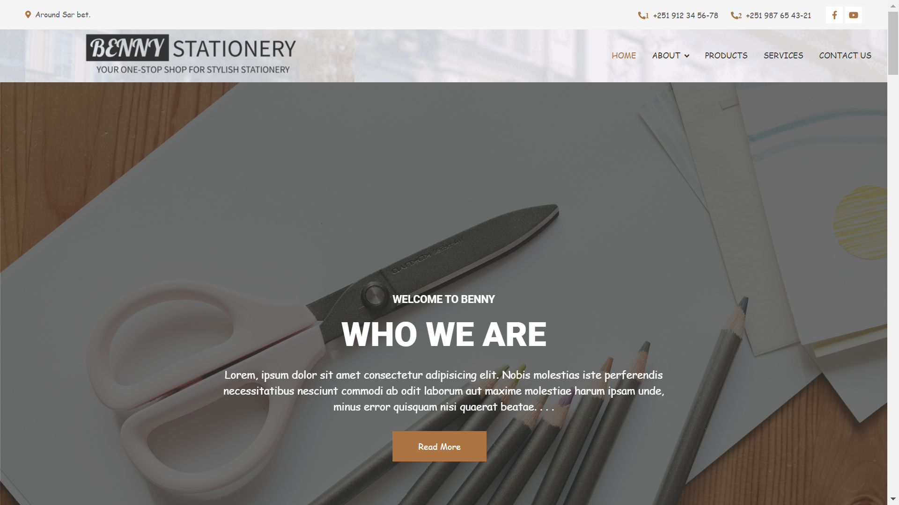

# BENNY STATIONERY

  
Table of Contents

  <ol>
    <li><a href="#our-group-name-origin">Our Group Name Origin</a></li>
    <li><a href="#acknowledgments">Acknowledgments</a></li>
    <li>
      <a href="#about-the-project">About The Project</a>
      <ul>
        <li><a href="#built-with">Built With</a></li>
      </ul>
    </li>
    <li><a href="#structure">Structure</a></li>
    <li><a href="#future-updates">Future Updates</a></li>
  </ol>

## Our Group Name Origin
The group name "`BENNY` represents the initials of our members' names: Biruk, Ezra, Nathan, Napi, and Yetemgeta. We also include Sandros in the acronym by using the letter "S" in `stationery.` This symbolizes our unity, acknowledges every member, and reflects our shared goals and individual contributions. Our group identity is a testament to our strong bond and collective strength.

## Acknowledgements:

* We are grateful to God for guiding and supporting us throughout this project.

* Thank you to Dan Energy for providing us with the opportunity to participate in this valuable coding course. The knowledge and skills gained have been truly beneficial.

* Our classmates deserve acknowledgement for their kindness and support throughout our learning journey. Their encouragement has made the experience even more enjoyable.

* We extend our heartfelt appreciation to our instructors and mentors for their guidance and dedication, which has been instrumental in our learning and growth.

These acknowledgements highlight the collaborative efforts and support that have contributed to our achievements.

(<a href="#readme-top">back to top</a>)

  

  <h3 align="center">BENNY STATIONERY</h3>

  

Benny Stationery: Where your imagination can run wild.     
    <a href="https://github.com/yetemgeta/Benny._.stationery"><strong>Github Repository  »</strong></a>
     

(<a href="#readme-top">back to top</a>)

## About the project

 
   

This project was a collaborative effort by the members of the `BENNY` group. Initially, we planned to utilize `HTML`, `CSS`, `Javascript`, and `Python`. However, we encountered significant difficulties when attempting to integrate `Python` with `HTML`. As a result, we proceeded with using only `HTML`, `CSS`, and `Javascript`.

>We would like to emphasize that our project is still a work in progress and lacks substantial development. As grade 12 students, we faced time constraints due to our commitments to exams and assignments. This is version 1 of our project, and we fully intend to dedicate more time and effort to future versions, striving to deliver a significantly improved result.

(<a href="#readme-top">back to top</a>)

## Built with

* 

* 

<!-- <a href="https://en.wikipedia.org/wiki/html">HTML</a> -->

<!-- <a href="https://en.wikipedia.org/wiki/css">CSS</a> -->

* 
<!-- <a href="https://en.wikipedia.org/wiki/JavaScript">JAVASCRIPT</a>> -->

### Frameworks, Libraries & Programs Used

<ol>
  <li>
  <a href="https://getbootstrap.com/docs/4.4/getting-started/introduction/">Bootstrap 4.4.1</a>
  </li>
  <ul>
    <li>Bootstrap was used to assist with the responsiveness and styling of the website.
</li>
  </ul>
  <li><a href="https://fonts.google.com/">Google Fonts</a></li>
  <ul>
    <li>Google fonts were used to import the 'comic sans ms' font into the style.css file which is used on all pages throughout the project.</li>
  </ul>
  <li><a href="https://git-scm.com/">Git</a></li>
    <ul>
        <li>Git was used for version control by utilizing the Gitpod terminal to commit to Git and Push to GitHub.
        </li>
    </ul>
<li><a href="https://github.com/">Github</a></li>
    <ul>
        <li>GitHub is used to store the projects code after being pushed from Git.
        </li>
    </ul>

</ol>

### Others

(<a href="#readme-top">back to top</a>)

## Structure

&bull; The home page is `index.html` file. 
&bull; the `css` folder contains all the CSS files for the website. 
&bull; the `img` folder contains all the image files for the website. 
&bull; the `js` and `lib` folders are used for JavaScript and libraries, respectively, on the website. 
&bull; `404.html` file is an HTML file that we use as a template to connect external files such as the `About Us` and `Contact Us` pages. 
&bull; `back.html` file is the page that contains the inventory management page. 

(<a href="#readme-top">back to top</a>)

## Future Updates

In our upcoming updates, we have planned the following enhancements:

- Integration of Python: We are actively working on adding Python functionality to our website, allowing for expanded capabilities and features.

- Improvements to `back.html`:
  - Scanner Feature: We will be introducing a scanner feature that will enhance the analysis of HTML code.
  - User Interface Enhancements: Our team is dedicated to refining the user interface of `back.html`, ensuring an improved and user-friendly experience.
  - Sorting and Filtering: Enable sorting and filtering options to organize the inventory list based on attributes such as name, quantity, price, category, or availability.
  - Add/Edit/Delete Items: We will continue to enhance the functionality for adding new items to the inventory, editing existing item details, and removing items that are no longer in stock.
  - Barcode Scanning: Integrate barcode scanning capabilities to simplify the process of adding or updating items in the inventory system.

(<a href="#readme-top">back to top</a>)

## How To Use It

> [!WARNING]  
> We use dummy text (also known as Lorem Ipsum) for the content of our website since it is a sample page.

    We use dummy text (also known as Lorem Ipsum) for the content of our website since it is a sample page!

In order to use our website, you should first open the `index.html` file. The first thing you'll see, after the spinner of course, is the OwlCarousel section, which contains information about who we are, our vision and mission, and our facilities.

 
  

### About us

When you scroll down a little bit, you will come across the `About Us` section. This section provides detailed information about our organization, its history, and its values. It serves as an introduction to who we are, what we stand for, and what sets us apart from others in our industry.  

 

### Gallery

 After the `About Us` section, you will be presented with the captivating `Gallery` section, showcasing a collection of sample images featuring our exceptional products. This visually appealing section is designed to provide you with a glimpse of the high-quality and diverse range of offerings we have available.  

    

### Who We Are

  You might wonder who has the privilege of offering such magnificent products. To satisfy your curiosity, you can visit the `Who We Are` section, where you can delve deeper into our company's background, values, and the team behind our exceptional offerings. This section provides valuable insights into the people and the passion that drive our organization.
  

   

### Register

After the `Who We Are` section, you will encounter the enticing "Register" section. While we will discuss this section in more detail shortly

    

### Contact us

Through the `Contact Us` section, you have the convenient option to get in touch with us directly. We value open communication and strive to provide prompt and helpful assistance to address any inquiries, concerns, or feedback you may have.  
 
   

 ### Company Employees

After the `Contact Us` section, you will find the `Company Employees` interface. This interface provides a convenient platform for accessing information about our dedicated team members and their respective roles within the company.
   

  
    

  ### Testimonial(What Customers Say)

We take great pride in being recognized as the best, and we back up that claim with tangible proof. One of the strongest pieces of evidence validating our excellence lies within the `What Customers Say` section of our website.

In the `What Customers Say` section, you will find a compilation of genuine feedback and testimonials from our beloved customers. These testimonials serve as a testament to the exceptional experiences our customers have had with our products and services. 
    
  
   

  ### Additional 

 Beside the sections mentioned above, we have additional sections on our homepage that provides essential information and quick access to various resources. This sections typically are ... 
  
  ### Header

  <!-- This is the part that we used to show our Address(place and phone number), our social medias, our LOGO, And <a href="#pages">Another pages</a> -->

  The header section is typically located at the top of the webpage and serves as a consistent element across all pages of your website. It often includes Logo, Address and Contact Information, Social Media Links,  and  <a href="#pages">Navigation Menu</a>

   

   ### Footer

   The footer section is located at the bottom of the webpage and is also consistent across all pages of your website. It often includes Address and Contact Information, Quick Links, Services and our Logo.

  

  ## Pages

  Unfortunately, the current state of the website only offers a single page, the `404.html` file. This means that users may encounter difficulties accessing the content they are seeking. However, Me and my team want to assure you that we are actively working on expanding the website's offerings in future updates. 

  ### 404.html

This page currently serves as a temporary placeholder on our website. Its purpose is to act as a link or redirection point to other essential pages, such as the "About" page, the "Contact" page, and more. We understand that encountering a 404 error can be frustrating for users, as it typically indicates that the requested page is not found.

   

   ### Back.html

   This page serves as the backbone of our project, playing a crucial role in the success of our company. By entering the required information in the "register" section, you can easily access this page and experience its valuable features. Once you have completed the registration process, you will be automatically redirected to the "back.html" page, granting you seamless access to its contents and functionalities.

  

This page boasts a plethora of diverse and valuable elements, and we have exciting plans to incorporate additional features in the future. Let's delve into the contents of this page, starting with the prominent header section. At the top, you will find an elegant header displaying a captivating quote, along with the various pages and a distinctive logo that represents our brand.

In the image, you'll notice a striking arrow with the text "open." This visual cue invites users to discover more by revealing the side panel. Simply clicking or tapping the arrow triggers the graceful unfolding of the side panel, unveiling a plethora of additional functionalities and options.

Below the side panel arrow, you'll find the navigation menu, which is also available on the home page. However, the main focus of the page is the table — an inventory management system created using HTML, CSS, and JavaScript. We have plans to incorporate Python to further enhance its features.

In the image provided, you'll notice a search box positioned at the top of the table. This feature enables users to search for and access specific items within the table. The main interface of the table consists of five columns. The first column lists the items, while the second column displays their corresponding values. The third column represents the quantity of each item, and in the fourth column, you can find the total amount. The total amount is calculated by multiplying the quantity of an item by its value. The last column, known as the action column, allows users to delete specific items from the table.

Beneath the table, you'll find 4 buttons: "Add row," "Save," "Export," and "Choose file." The "Add row" button enables users to add a new row for an item, expanding the table as needed. The "Save" button serves as a saving the table and calculating the total value based on the provided information. The "Export" button allows users to save the table as a CSV file, facilitating data sharing and backup. Lastly, the "Choose file" button enables users to import a CSV file into the table or workspace, providing a convenient way to import existing data.

These buttons and functionalities contribute to the overall usability and versatility of the inventory management system, making it easier for users to add, edit, save, and export data effortlessly.

### side panel 

 
    
 
      
 On the side panel, users have access to three helpful tools: a calendar, a note-taking feature, and a calculator. These tools aim to enhance productivity and provide convenient utilities for users while they work.

The calendar allows users to keep track of important dates, appointments, and events. It provides a visual representation of dates and can be customized to display daily, weekly, or monthly views. Users can add, edit, and delete events, set reminders, and efficiently manage their schedules.

The note-taking feature enables users to jot down ideas, make to-do lists, or capture important information. It provides a digital space for users to create and organize their notes. Users can easily create new notes, edit existing ones, and categorize them for easy reference. This feature helps users stay organized and ensures important information is readily accessible.

The calculator tool provides a convenient way for users to perform calculations without the need for a separate application. It allows users to perform basic arithmetic operations such as addition, subtraction, multiplication, and division. The calculator is user-friendly and provides a simple interface for quick and efficient calculations.
      
 
    
 
    
 
       
    
 

